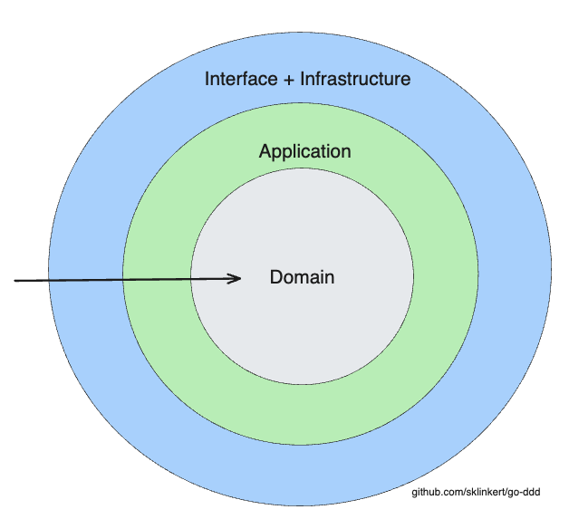

# Go-DDD: Domain Driven Design Template in Golang

Welcome to `go-ddd`, a reference implementation/template repository demonstrating the [Domain Driven Design (DDD)](https://en.wikipedia.org/wiki/Domain-driven_design) approach in Golang. This project aims to help developers and architects understand the DDD structure, especially in the context of Go, and how it can lead to cleaner, more maintainable, and scalable codebases.

## Overview

Domain-Driven Design is a methodology and design pattern used to build complex enterprise software by connecting the implementation to an evolving model. `go-ddd` showcases this by setting up a simple marketplace where `Sellers` can sell `Products`.

### Why DDD?

- **Ubiquitous Language**: Promotes a common language between developers and stakeholders.
- **Isolation of Domain Logic**: The domain logic is separate from the infrastructure and application layers, promoting SOLID principles.
- **Scalability**: Allows for easier microservices architecture transitions.

## Repository Structure



- `domain`: The heart of the software, representing business logic and rules.
    - `entities`: Fundamental objects within our system, like `Product` and `Seller`. Contains basic validation logic.
- `application`: Contains use-case specific operations that interact with the domain layer.
- `infrastructure`: Supports the higher layers with technical capabilities like database access.
    - `db`: Database access and models.
    - `repositories`: Concrete implementations of our storage needs.
- `interface`: The external layer which interacts with the outside world, like API endpoints.
    - `api/rest`: Handlers or controllers for managing HTTP requests and responses.

## Further principles

- Domain
  - Must not depend on other layers.
  - Provides infrastructure with interfaces, but must not access infrastructure.
  - Implements business logic and rules.
  - Executes validations on entities. Validated entities are passed to the infrastructure layer.
  - Domain layer sets defaults of entities (e.g. uuid for ID or creation timestamp). Don't set defaults in the infrastructure layer or even database!
  - Do not leak domain objects to the outside world.
- Application
  - The glue code between the domain and infrastructure layer.
- Infrastructure
   - Repositories are responsible for translating a domain entity to a database model and retrieving it. No business logic is executed here.
   - Implements interfaces defined by the domain layer.
   - Implements persistence logic like accessing a postgres or mysql database.
   - When writing to storage, read written data before returning it. This ensures that the data is written correctly.

## Best Practices

- Don't return validated entities from read methods in the repository. Instead, return the domain entity type directly.
  - Validations might change in the future, and you don't want to change all the data in your database.
  - Otherwise, you won't be able to read data from the database that was written with a different validation logic.
- Don't put default values (e.g current timestamp or ID) in the database. Set them in the domain layer (factory!) for several reasons:
  - It's quite dangerous to have two sources of truth.
  - It's easier to test the domain layer.
  - Databases can get replaced, and you don't want to have to change all your default values. 
- Always read the entity after write in the infrastructure layer.
  - This ensures that the data is written correctly, and we are never operating on stale data.
- `find` vs `get`:
  - `find` methods can return null or an empty list.
  - `get` methods must return a value. If the value is not found, throw an error.
- Deletion: Always use soft deletion. Create a `deleted_at` column in your database and set it to the current timestamp when deleting an entity. This way, you can always restore the entity if needed.

## Getting Started

1. Clone this repository:
```bash
git clone https://github.com/sklinkert/go-ddd.git
cd go-ddd
go mod download
go run ./...
```

### Contributions
Contributions, issues, and feature requests are welcome! Feel free to check the issues page.

### License
Distributed under the MIT License. See LICENSE for more information.
