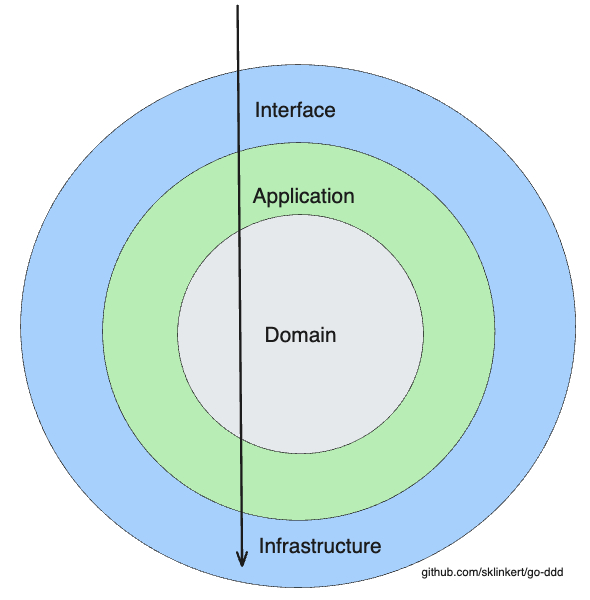
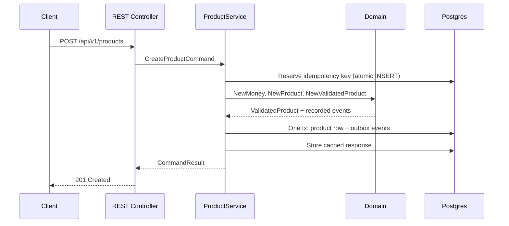

# Architecture reference

The one-page version of the rules the tutorial builds up. If you're evaluating the template or enforcing conventions in review, this is the page to keep open.

## The onion



Dependencies point **inward only**. The domain sits at the center and imports nothing from the layers around it.

```
internal/
├── domain/           # entities, value objects, events, repository INTERFACES
├── application/      # commands, queries, services (orchestration)
├── infrastructure/   # Postgres/sqlc repositories, outbox relay, config
└── interface/        # REST controllers, DTOs
```

| Layer | May import | Must never import |
|---|---|---|
| `domain` | stdlib, `google/uuid` | application, infrastructure, interface, any framework or driver |
| `application` | domain | infrastructure, interface, Echo, pgx |
| `infrastructure` | domain, application | interface |
| `interface` | application, domain (types only) | infrastructure |

The wiring point where everything meets is [`cmd/marketplace/main.go`](https://github.com/sklinkert/go-ddd/blob/main/cmd/marketplace/main.go): it constructs concrete repositories, injects them into services, and hands services to controllers. No other file knows all the layers.

## Layer responsibilities

**Domain** ([tutorial 1](../tutorial/01-the-domain.md)–[4](../tutorial/04-aggregates.md)) — the model. Entities enforce their invariants via constructors and `validate()`; value objects like `Money` are unconstructible in invalid states; aggregates reference each other by Id only; repository *interfaces* declare what persistence the model needs. Errors are sentinels (`ErrValidation`, `ErrProductNotFound`) that outer layers translate.

**Application** ([tutorial 6](../tutorial/06-cqrs.md), [8](../tutorial/08-idempotency.md)) — the use cases. Commands and queries as explicit types; services orchestrate (load aggregates, invoke domain behavior, persist) but never decide business rules; the `withIdempotency` decorator makes every command retry-safe. Results are output shapes, not entities.

**Infrastructure** ([tutorial 5](../tutorial/05-repositories.md), [7](../tutorial/07-domain-events-outbox.md)) — the details. sqlc-generated, type-safe SQL behind the domain's repository interfaces; row-to-entity mapping routes through validating constructors; the aggregate write and its outbox events share one transaction; the relay polls and publishes with at-least-once semantics.

**Interface** — the edge. Echo controllers parse DTOs, call services, and map sentinel errors to status codes in [`errors.go`](https://github.com/sklinkert/go-ddd/blob/main/internal/interface/api/rest/errors.go): `ErrProductNotFound` → 404, `ErrValidation` → 400, `ErrRequestInFlight` → 409, `ErrIdempotencyKeyReuse` → 422. DTOs use explicit primitives (`price_minor_units`, not `price`) so the wire format can never be ambiguous.

## The request flows

Write path:



Read path: controller → query → service → repository → result mapping. No entity construction ceremony, no idempotency, no events — reads have no business rules.

Event path: outbox relay polls `outbox_events WHERE published_at IS NULL` (partial index), hands each to a `Publisher`, marks published. At-least-once; consumers deduplicate on the UUIDv7 event Id.

## Conventions that keep the codebase consistent

- **Constructors everywhere.** `NewX` for every entity and value object; struct literals for domain types are a review flag outside the `entities` package and its tests.
- **`ValidatedX` types at trust boundaries.** Repository write methods accept only validated types — the compiler enforces the validation contract.
- **Sentinel errors, wrapped with `%w`.** Match with `errors.Is`; never branch on error strings.
- **`Id`, not `ID`.** House style, enforced deliberately (the corresponding staticcheck rules are disabled in `.golangci.yml` on purpose).
- **Soft deletes.** `deleted_at` columns; every read query filters `deleted_at IS NULL`. Deleted data is invisible, not gone.
- **Migrations are append-only.** Schema evolves through numbered `migrations/` pairs (`up`/`down`); sqlc regenerates the query layer from `sql/queries/` via `make sqlc`.
- **Defaults live where the invariant lives.** Business defaults belong in domain code, not split between code and DB where they can drift.

## Tooling map

| Concern | Tool | Where |
|---|---|---|
| HTTP | Echo v4 | `internal/interface/api/rest/` |
| DB access | pgx/v5 + sqlc | `internal/infrastructure/db/` |
| Migrations | golang-migrate | `migrations/`, `migrate.go` |
| Logging | slog | throughout |
| Tests | testify + testcontainers | `*_test.go`, `internal/testhelpers/` |
| Lint | golangci-lint v2 | `.golangci.yml` |
| API contract | OpenAPI 3 | `api/openapi.yaml` |
| Ops probes | `/healthz`, `/readyz` | `internal/interface/api/rest/health_controller.go` |

For the reasoning behind each of these decisions, the [tutorial](../tutorial/01-the-domain.md) walks them in order; for the trade-offs, the [FAQ](faq.md).
